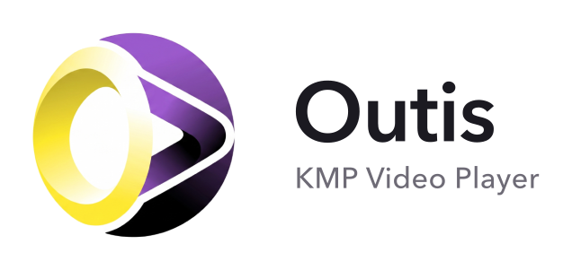

# Outis

***No one player.*** A Kotlin Multiplatform video player for **Android, iOS and Web**: one
engine-agnostic API, plus an optional Compose Multiplatform UI. Write your playback logic once; each
platform runs its native engine underneath — so there is no single player here, which is rather the point.

| Platform | Engine |
|---|---|
| Android | Media3 / ExoPlayer |
| iOS | AVFoundation `AVPlayer` |
| Web | Shaka Player (over an HTML `<video>`) |

No platform type and no Compose type ever appears in the core API, so `:core` is usable
from any KMP target; the Compose surface is a separate, optional module.

---

## Modules

| Module | Maven coordinate | What it is |
|---|---|---|
| `:core` | `io.github.nonbinarydev:outis-core:0.1.0-alpha01` | The engine-agnostic player: `VideoPlayer`, `PlayerState`, `PlayerEvent`, `MediaItem`, DRM. No UI. |
| `:ui` | `io.github.nonbinarydev:outis-ui:0.1.0-alpha01` | Compose Multiplatform `PlayerView` + a fully customisable controls overlay. Depends on `:core`. |

You can ship with just `:core` and build your own UI, or take `:ui` for a batteries-included player.

---

## Capability matrix

| | Android | iOS | Web |
|---|---|---|---|
| Progressive **MP4** | ✅ | ✅ (needs *faststart*) | ✅ |
| **HLS** | ✅ | ✅ (`avc1` only — not in-band-param `avc3`) | ✅ |
| **DASH** | ✅ | ❌ (AVPlayer is HLS-only) | ✅ |
| **Live** (HLS/DASH) | ✅ | ✅ (HLS) | ✅ |
| **Widevine** DRM | ✅ | ❌ | ✅ (Chrome/Edge/Firefox) |
| **PlayReady** DRM | ✅ | ❌ | ✅ (Edge) |
| **FairPlay** DRM | ❌ | ✅ | ✅ (Safari) |
| Audio / subtitle track selection | ✅ | ✅ | ✅ |

The DRM split is the unavoidable one: Widevine has no CDM on Apple platforms, FairPlay is Apple-only.
See **[docs/drm.md](docs/drm.md)** for how to target each.

---

## Install

Both modules are Kotlin Multiplatform. In a shared module's `commonMain`:

```kotlin
kotlin {
    sourceSets {
        commonMain.dependencies {
            implementation("io.github.nonbinarydev:outis-core:0.1.0-alpha01")
            implementation("io.github.nonbinarydev:outis-ui:0.1.0-alpha01")   // optional UI
        }
    }
}
```

Platform notes are in [Platform setup](#platform-setup) below — Android needs nothing extra, iOS
needs the framework wired into Xcode, Web needs the `shaka-player` npm dependency.

---

## Quick start

### Core only

```kotlin
import dev.nonbinary.outis.core.*
import dev.nonbinary.outis.core.source.*

// Construct on the main/UI thread (engines are main-thread-affine). Android passes a real context;
// iOS/Web take the no-arg AppContext().
val player = VideoPlayer(appContext)

player.setMediaItem(
    MediaItem(MediaSource.Url("https://example.com/master.m3u8"), mimeType = MimeType.HLS),
    autoPlay = true,
)

// Observe — `state` is a conflated snapshot for the UI; `events` is a timed, one-shot stream.
scope.launch { player.state.collect { render(it) } }

// Transport is fire-and-forget; results land on state/events.
player.play(); player.pause(); player.seekTo(30_000); player.setVolume(0.5f)

player.release()   // idempotent
```

`appContext` is an [`AppContext`](#appcontext-per-platform): `AppContext(context.applicationContext)`
on Android, `AppContext()` everywhere else.

### With the Compose UI (`:ui`)

```kotlin
import androidx.compose.runtime.*
import dev.nonbinary.outis.ui.*

@OptIn(ExperimentalPlayerUiApi::class)
@Composable
fun Player(appContext: AppContext) {
    val player = remember { VideoPlayer(appContext) }
    DisposableEffect(player) { onDispose { player.release() } }
    LaunchedEffect(player) {
        player.setMediaItem(MediaItem(MediaSource.Url("https://example.com/master.m3u8")), autoPlay = true)
    }
    PlayerView(player)          // batteries included — surface + customisable overlay
}
```

Full walkthroughs:
- **[docs/playback.md](docs/playback.md)** — sources, transport, state & events, the UI, tracks, live, quality caps, error handling.
- **[docs/drm.md](docs/drm.md)** — integrating Widevine / PlayReady / FairPlay protected streams.

---

## `AppContext` per platform

`VideoPlayer(context, config)` takes an `AppContext` so the Android engine can reach a `Context`
(needed by `ExoPlayer.Builder`). Everywhere else it carries nothing.

| Platform | Construct it as | Typical source |
|---|---|---|
| Android | `AppContext(applicationContext)` | from your `Activity` / `Application` |
| iOS | `AppContext()` | — |
| Web (JS) | `AppContext()` | — |

In a shared `App(appContext: AppContext)` composable, each platform entry point builds its own
`AppContext` and passes it down.

---

## Platform setup

### Android
- No extra player config. Your app needs `<uses-permission android:name="android.permission.INTERNET" />`.
- For fullscreen/PiP declare the capability on your Activity — see the UI guide and [`:ui` README](ui/README.md).
- The engine is pinned to the main `Looper`; build the player on the main thread.

### iOS
- Wire the KMP framework into your Xcode app with a *Run Script* build phase that invokes
  `./gradlew :core:embedAndSignAppleFrameworkForXcode` (add `:ui` too if you use the Compose surface),
  and add the build output to *Framework Search Paths*. Host the Kotlin entry point in a SwiftUI
  `UIViewControllerRepresentable`.
- The SDK sets the `AVAudioSession` category to `.playback` itself, so media audio plays through the
  hardware mute switch — you don't need to.
- For HTTP (non-TLS) test streams, add the relevant `NSAppTransportSecurity` keys to `Info.plist`.

### Web (JS)
- The Shaka engine pulls in the `shaka-player` npm package (declared by `:core`'s JS target); a
  webpack build bundles it.
- Compose Multiplatform renders the UI into one `<canvas>` (skiko). The web `PlayerSurface` keeps the
  engine's `<video>` **underneath** the canvas and punches a transparent hole through it
  (`BlendMode.Clear`), so the **same shared Compose overlay composites over the video** — just like
  Android/iOS, no native controls. See [docs/playback.md](docs/playback.md#web-surface) for the layering.

---

## Threading & lifecycle

- **Construct** `VideoPlayer(...)` on the main/UI thread.
- **Transport methods** (`play`, `seekTo`, `setMediaItem`, …) are safe to call from any thread and are
  fire-and-forget — each engine marshals to the thread it needs and reports results on `state`/`events`.
- **Always call `release()`** when done (it's idempotent). With Compose, do it in a `DisposableEffect`.

---

## Versioning

`0.1.0-alpha01`. The published contract is intentionally **additive**: new `VideoPlayer` methods keep
default bodies, new `PlayerState`/config fields arrive with defaults. At alpha, source-additive changes
may still be binary-incompatible (data-class `copy`/`componentN` arity) — recompile consumers.
